# Top 18 Referral Marketing Software Ranked in 2025 (Latest Compilation)

Tracking who brings in customers manually through spreadsheets feels like using a flip phone in 2025—technically it works, but why would you? Modern SaaS teams need automated systems that handle referral tracking, reward distribution, and performance analytics without eating up hours each week. Whether you're launching your first advocate network or scaling an established system, choosing software that integrates seamlessly with your billing stack and actually converts advocates into revenue matters more than feature lists.

## **[Tolt](https://tolt.io/)**

All-in-one referral tracking for SaaS startups seeking branded experiences and autopilot growth.

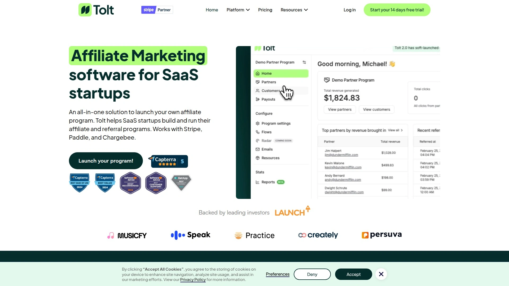

Tolt specializes in helping early-stage and growth-stage SaaS companies build branded referral portals that match their product identity. The platform connects directly with Stripe, Paddle, and Chargebee to track subscription events in real time, ensuring reward calculations align precisely with actual revenue. Companies using Tolt report 30% reductions in fraudulent sign-ups within the first month thanks to built-in fraud detection engines.

The white-label portal lets teams launch public or private programs under custom domains like affiliates.yourbrand.com, eliminating generic subdomains that dilute brand trust. Automated payout features process rewards through PayPal and Wise within 48 hours of approval, removing manual payment headaches. Cross-subdomain tracking handles apps hosted on app.domain.com structures without losing referral attribution.

Growth teams value the percentage or fixed structure options—you can offer affiliates either a percentage of plan revenue or flat amounts per conversion. Email notifications are fully customizable, letting you brand every touchpoint from new referral alerts to payout confirmations. The platform maintains 99.9% uptime while rolling out two major feature releases each quarter despite operating with fewer than 10 employees.

Early adopters backed through the LAUNCH Accelerator program helped Tolt onboard over 1,000 clients including Prisma.io, Superside, and Scrimba.com within three years. When the platform launched on Product Hunt in May 2025, it claimed the top spot with 472 upvotes. Average implementation time sits at 15 minutes for teams using supported billing platforms.

## **[GrowSurf](https://growsurf.com/)**

Customer-to-customer referral engine built specifically for tech startup velocity and viral loops.

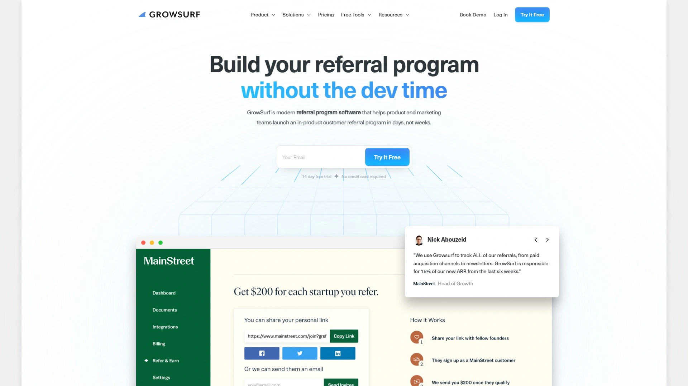

GrowSurf positions itself as referral software designed for tech startups that need to move fast. Marketing and product teams choose this platform to maximize results without heavy setup requirements. Users report metrics like 312% return on investment, with 30% of new leads originating from referral channels and 15% of annual recurring revenue tied directly to referral-driven signups.

The platform emphasizes speed to launch—teams can deploy working programs faster than most competitors. Tech startups appreciate the focus on viral mechanics that encourage exponential sharing behaviors rather than simple one-time referrals. Integration capabilities connect with standard SaaS tools, though the platform specifically targets companies operating in high-growth technology sectors.

## **[Viral Loops](https://viral-loops.com/)**

Pre-built campaign templates for brands launching viral marketing mechanics without developer resources.

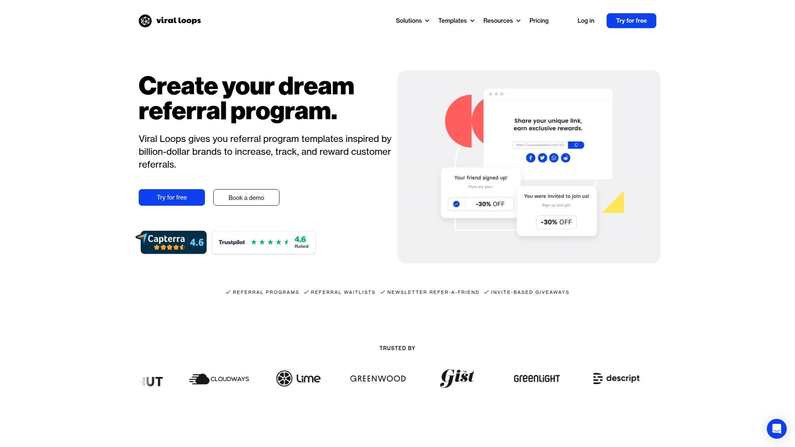

Viral Loops provides ready-made campaign structures that brands can deploy immediately. The template library covers common viral marketing patterns, letting teams skip custom development work. Marketing departments without technical resources find value in drag-and-drop campaign builders that handle referral mechanics out of the box.

The platform supports multiple languages and integrates with e-commerce platforms like Shopify, Magento, and WooCommerce. Teams can customize landing pages and sharing flows to match brand guidelines while maintaining pre-built viral mechanics. Analytics dashboards track shares, clicks, and conversions across devices and platforms.

## **[ReferralCandy](https://www.referralcandy.com/)**

E-commerce-focused referral automation for online stores seeking plug-and-play customer advocacy.

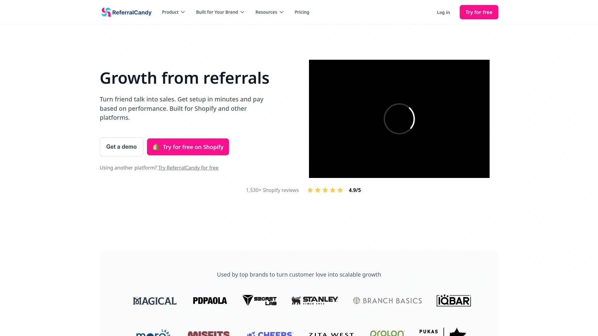

ReferralCandy targets e-commerce businesses and retail brands looking for straightforward setup processes. The platform connects with major e-commerce platforms and automates reward distribution without manual intervention. Stores using ReferralCandy can configure and customize programs quickly, making it accessible for teams without dedicated technical staff.

The system emphasizes automated customer outreach, turning satisfied buyers into active promoters through triggered email and text campaigns. Reward management handles both customer and advocate incentives across various formats. Integration depth with Shopify and similar platforms means order data flows automatically into referral tracking.

## **[Referral Rock](https://referralrock.com/)**

Full-featured member portals for SaaS, e-commerce, and service businesses managing complex reward structures.

Referral Rock offers stand-alone member portals where program participants track referral status and view reward payments. The platform supports customer referral, partner, and brand ambassador use cases with tiered, multi-step, and recurring reward options. Teams can automate payout fulfillment through gift cards, coupons, cash, and custom rewards.

Integration support spans 50-plus tools including HubSpot, Salesforce, MailChimp, Marketo, and LeadPages. Concierge onboarding services help teams launch effective programs quickly rather than figuring out configurations alone. Pre-crafted email, social media, and SMS messages promote easy customer sharing without designing templates from scratch.

Member and referral dashboards let teams identify top brand advocates and measure campaign success across different channels. The platform's pricing starts at $200 monthly for starter plans, scaling to $800 for established business features. Some integrations require technical setup despite the platform's emphasis on ease of use.

## **[Friendbuy](https://www.friendbuy.com/)**

Enterprise-grade referral and loyalty platform with advanced A/B testing for global consumer brands.

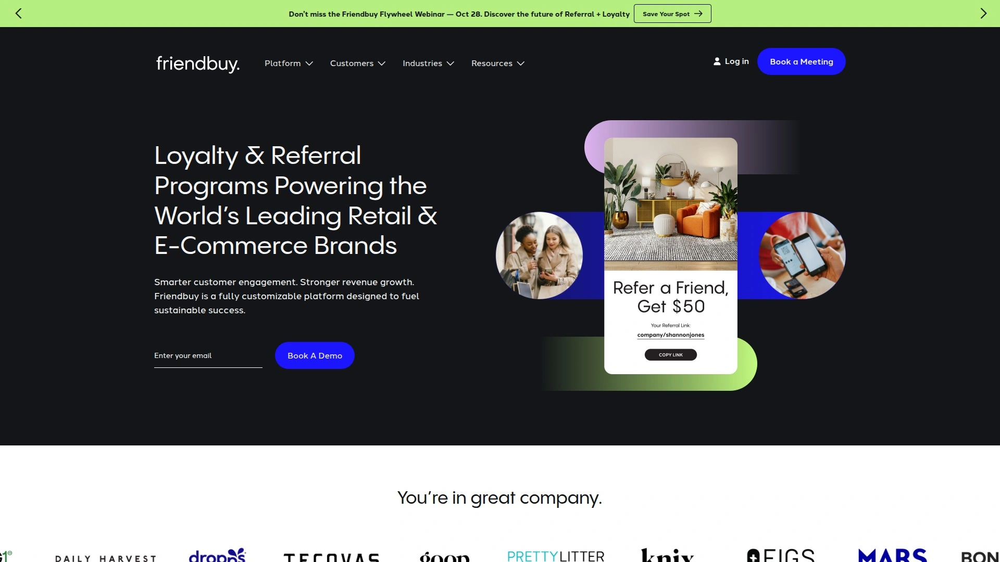

Friendbuy powers referral and loyalty programs for major brands like Disney, Nestle, and Walmart. The platform comes with widget builders, editors, and customization features that let teams create branded referral experiences. You can deploy these widgets anywhere on websites or mobile apps, with APIs and event triggers available for deeper customization.

Extensive A/B testing and tracking capabilities make it straightforward to optimize programs based on performance data. Analytics tools provide in-depth testing frameworks that enterprise teams need to justify program investments. The platform scales for enterprise-level referral programs without requiring heavy upfront development work.

Customization requires at least basic coding knowledge despite the builder tools. Pricing structures may prove steep for smaller businesses, and the company doesn't publish a pricing page. The platform emphasizes points systems more than direct rewards like gift cards or cashback. Communication with customers through Friendbuy's platform remains limited compared to dedicated email tools.

## **[PartnerStack](https://partnerstack.com/)**

Partner ecosystem management for B2B SaaS running multiple program types side-by-side.

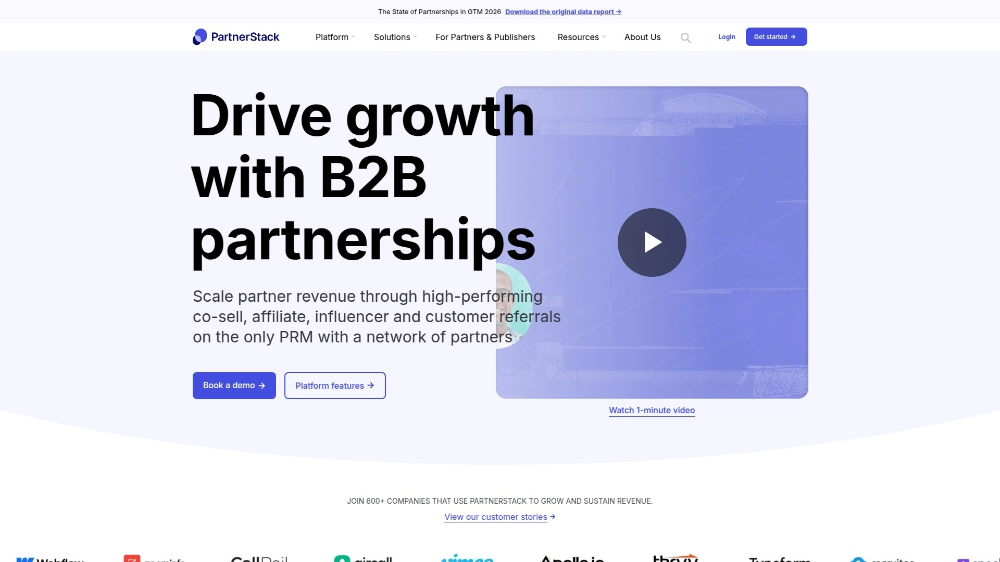

PartnerStack accelerates growth for B2B software companies through comprehensive partner management. The platform handles different partnership types including affiliates, referrals, and resellers within a single system. Companies like monday.com, Webflow, and ZoomInfo use PartnerStack to promote, manage, and scale their partner programs.

Automated processes handle partner onboarding, training, calculations, and payments without manual intervention. Real-time analytics track program performance and metrics, giving teams actionable insights for optimization. The platform provides customized partner onboarding processes and automated payment systems with transparent structures.

Every partner on PartnerStack accesses their own dashboard to measure performance, access resources, and withdraw payments. Implementation timelines typically run under 45 days with no hidden costs. The system integrates with HubSpot and other standard B2B tools to sync partner data with existing workflows.

## **[Tapfiliate](https://tapfiliate.com/)**

Cloud-based tracking for e-commerce, SaaS, and B2C brands managing influencer and multi-level marketing.

Tapfiliate serves businesses across e-commerce, SaaS, retail, and subscription services with 30-plus plug-and-play integrations. Teams can set up programs in minutes by adding pre-formatted code to any site. Features include white-label branding, custom referral links, automated calculations, and performance management.

The platform tracks activity, manages referral content, and automates workflows from recruitment to payout. Integration support covers Stripe, Shopify, PayPal, Wix, and more, with 6 language options. The REST API extends functionality for teams that want to automate custom workflows.

Software companies benefit from specialized features like trial-to-paid tracking and customer lifetime value calculations. Multi-level marketing capabilities handle complex structures where participants earn from multiple referral levels. Communication tools include in-platform messaging for broadcasts or private conversations with individual partners. Pricing starts at $89 monthly for essential plans with unlimited affiliates.

## **[Referral Factory](https://referral-factory.com/)**

Drag-and-drop builder with 1,000-plus templates for multilingual campaigns across currencies.

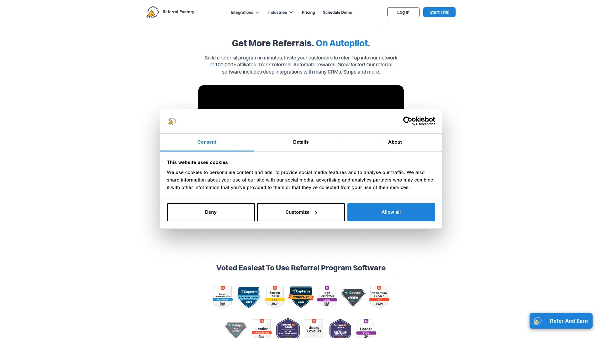

Referral Factory provides an easy drag-and-drop builder for referral pages and emails. Over 1,000 templates cover various industries and campaign types. Multi-language support and multiple currency options make it suitable for international programs.

Reward options span cash, gift cards, coupons, and custom rewards in various currencies. Automatic referral tracking and reward distribution simplify program management. The platform connects with major CRMs and marketing tools through standard integrations.

Quick setup processes help businesses launch programs fast, though cheaper plans limit customization options. Analytics remain basic compared to enterprise platforms. Custom web addresses cost extra beyond standard pricing. User ratings on G2 reach 4.8 out of 5, reflecting satisfaction with ease of use. Pricing starts at $95 monthly with a 15-day trial period.

## **[Ambassador](https://www.getambassador.com/)**

Relationship marketing platform combining referral, influencer, and brand ambassador programs.

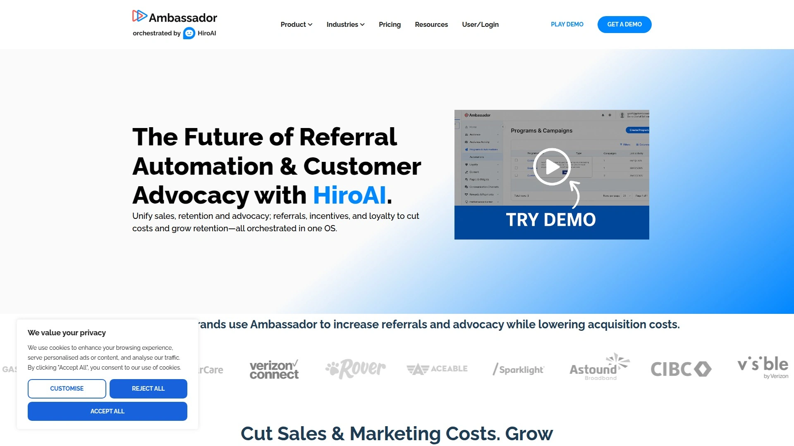

Ambassador describes its services as relationship marketing designed to manage multiple advocate types. The platform enrolls customers, affiliates, and influencers while tracking promotional activities and referrals. Automated reward distribution and campaign analysis tools handle performance measurement.

Simple visual editors and pre-built templates reduce setup complexity. The all-in-one approach lets teams set up campaigns, monitor performance, and pay participants from one interface. Payment options include multiple methods for flexibility.

The platform serves both refer-a-friend programs and traditional structures. Customers stay informed throughout the referral process to encourage continued participation. Installation takes time compared to lighter-weight options. Campaign customization options are somewhat limited despite the visual editor. Businesses seeking straightforward customer-only referral programs may find the feature set more extensive than needed.

## **[Mention Me](https://www.mention-me.com/)**

Customer advocacy platform with name-sharing features for established retail and e-commerce brands.

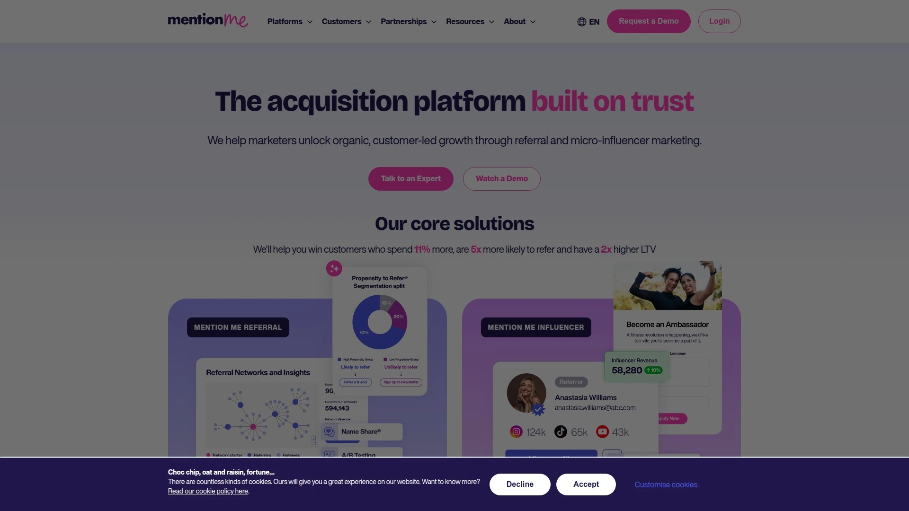

Mention Me focuses on referral marketing and broader customer advocacy initiatives. Established retail and e-commerce brands use the platform for optimized customer advocacy. A/B testing tools for referral offers help teams identify winning incentive structures.

The "name sharing" feature enables referrals by mentioning a friend's name without needing codes. Segmentation capabilities let teams target different customer groups with tailored campaigns. Detailed reporting covers advocate behavior and new customer acquisition metrics.

The platform involves a consultative setup process and targets larger businesses. Organizations with specific goals around optimizing customer advocacy beyond simple referrals benefit most from the comprehensive feature set.

## **[SaaSquatch](https://www.saasquatch.com/)**

Configurable loyalty, referral, and rewards system for SaaS and e-commerce with tiered structures.

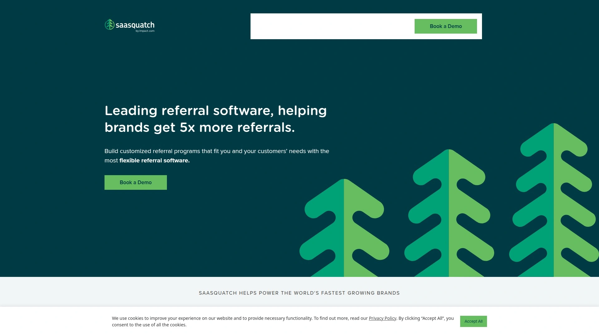

SaaSquatch helps businesses in SaaS and e-commerce create and manage multiple program types. The platform enables configuration of tiered loyalty structures, friend referral campaigns, and partner programs. Multiple reward types with tracking for participant activity and engagement come standard.

Broad focus across loyalty and rewards systems beyond customer-to-customer referrals provides flexibility. The depth of specific referral-only features may differ from singularly focused referral tools. Teams needing comprehensive loyalty program features alongside referral mechanics find value in the combined approach.

## **[impact.com](https://impact.com/)**

Full partnership management with fraud prevention and smart tools for enterprise-scale operations.

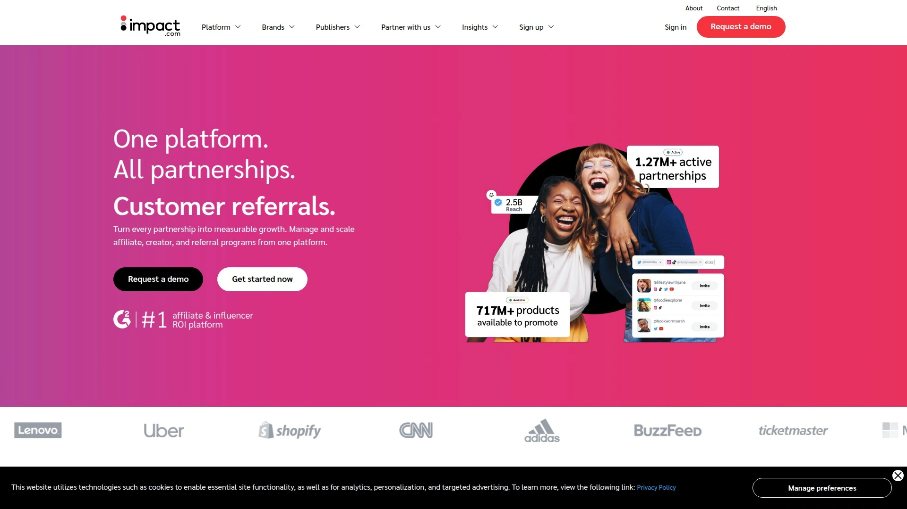

impact.com provides a complete partnership management platform with well-reviewed referral program software. Easy connections and usage make implementation straightforward for enterprise teams. Businesses can change rewards to align with sales goals, increasing participation rates.

Smart tools stop fraud activity, keeping programs secure. Expert support helps businesses set up and improve programs with training resources like PXA courses. The platform connects referral data with other tech tools while automating rewards and follow-ups.

Reviews highlight reliability and comprehensive features that help businesses grow quickly. Many companies choose impact.com for strong support and smooth operations at scale.

## **[Yotpo Loyalty & Referrals](https://www.yotpo.com/)**

Customizable VIP tiers and reward displays for e-commerce brands with strong analytics dashboards.

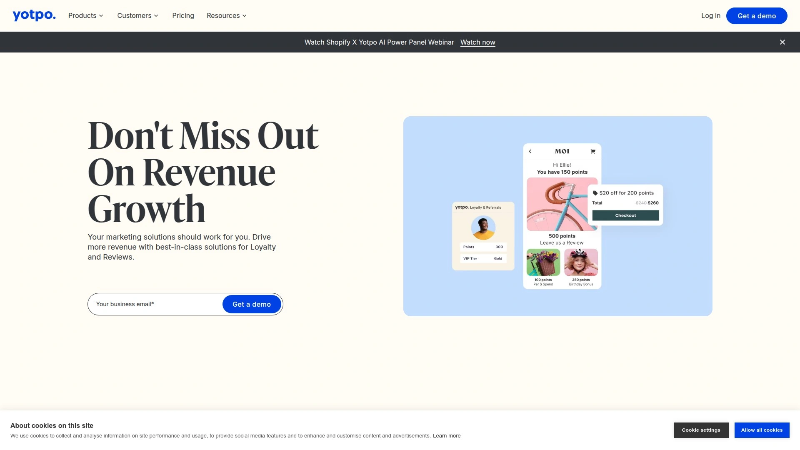

Yotpo Loyalty & Referrals lets businesses customize VIP tiers, rewards, and on-site displays. Customer Success Managers provide hands-on help throughout program management. Strong segmentation and targeted campaigns leverage customer data for personalized experiences.

Analytics and dashboards offer clear visibility into program performance. Advanced features include point expiration and built-in referral marketing systems. The platform works well with e-commerce platforms and marketing tools, especially when combined with other Yotpo products.

Pricing runs higher than some alternatives, with certain features requiring additional payment. Platform complexity means some businesses need extra implementation help. Brands should consider their size, integration needs, and budget before selecting Yotpo.

## **[Affise](https://affise.com/)**

Performance marketing platform with deep analytics and 50-plus data breakdowns for enterprises.

Affise offers robust performance marketing tools that include comprehensive referral program software. Businesses choose it for deep analytics and optimization capabilities. Customizable dashboards and real-time reporting provide visibility into campaign performance.

Deep reporting features over 50 data breakdowns for detailed analysis. Extensive customization options and feature-rich APIs enable integration with third-party services. Automation functionalities reduce manual work, while flexible management and advanced targeting improve results.

A free onboarding package with dedicated specialists helps teams get started. Pricing typically ranges from $500 to $1,500 monthly, positioning it for larger enterprises with complex needs. The platform has a steeper learning curve than user-friendly options. Some users report occasional glitches requiring manual adjustments for accurate tracking. Customer support may be limited outside business hours for some plans.

## **[InviteReferrals](https://www.invitereferrals.com/)**

User-friendly platform with WhatsApp and SMS referrals across multiple languages and devices.

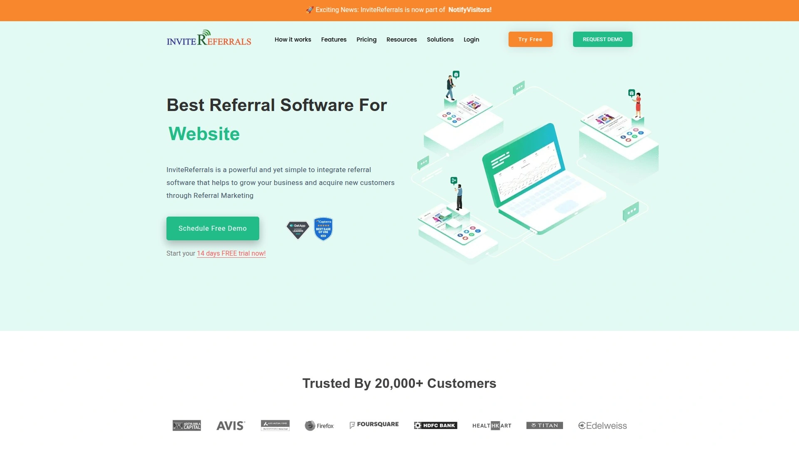

InviteReferrals emphasizes simplicity and ease of use with strong tracking and analytics across devices. Businesses create highly customizable referral campaigns with in-depth analytics tracking shares, clicks, and conversions. Multi-language support accommodates international programs.

WhatsApp and SMS referral options reach customers on preferred communication channels. Integration with popular e-commerce tools like Shopify, Magento, and WooCommerce streamlines setup. Referral program widgets work seamlessly across all devices and platforms.

Some users find initial campaign setup complex despite the platform's user-friendly reputation. Specific campaign types might be limited in flexibility. Lower-tier plans lack some advanced features. Pricing starts at $99 monthly with a 14-day trial available.

## **[Cello](https://cello.so/)**

User-led growth platform embedding in-product referral and advocate programs for B2B SaaS.

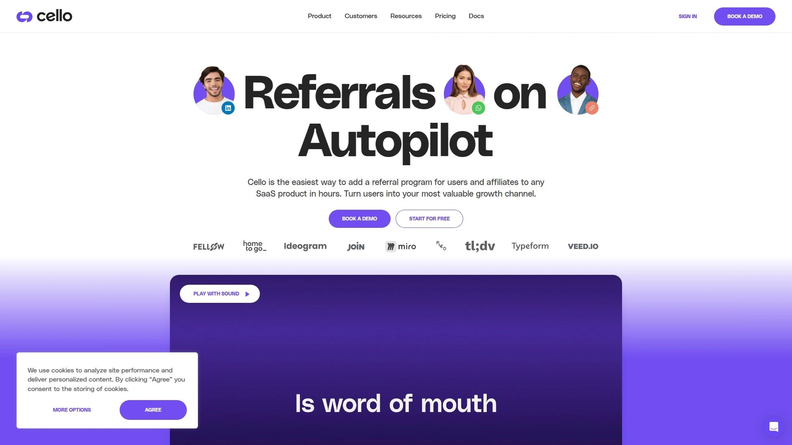

Cello operates as a user-led growth platform designed specifically for B2B SaaS products. The platform adds referral programs directly into SaaS products rather than relying on external portals. In-product embedding increases visibility and participation by meeting users where they already work.

Integration of user and advocate programs creates cohesive growth mechanics. B2B SaaS teams seeking native integration within product experiences find Cello's approach valuable. The platform emphasizes seamless user experience over standalone referral portals.

## **[Annex Cloud](https://www.annexcloud.com/)**

Enterprise loyalty platform nurturing customer relationships across channels with review and UGC features.

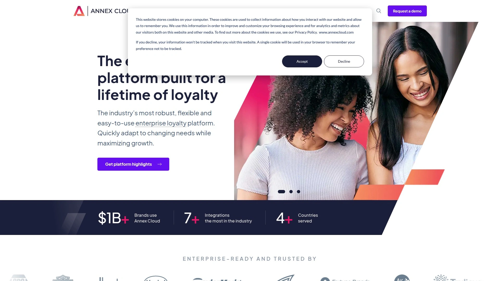

Annex Cloud's loyalty platform nurtures happy customers across all channels. The platform extends beyond basic referrals to encourage reviews, user-generated content, and social sharing. White-label structure targets larger businesses exclusively.

Multiple products need to be purchased to access all advocacy features. Enterprise-level businesses across industries use the platform for connected customer engagement strategies. The system focuses on customer advocates rather than other advocate types.

## **[Brandbassador](https://brandbassador.com/)**

App-based gamification platform turning loyal customers and followers into official brand ambassadors.

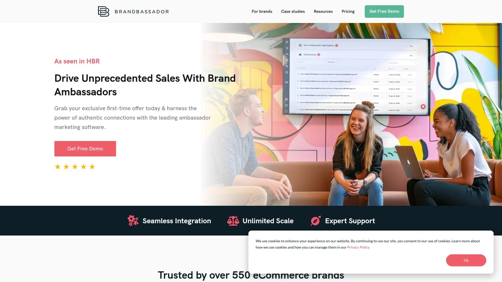

Brandbassador uses an app-based platform that gamifies customer advocacy programs. Customers apply to become official ambassadors of brands through the mobile app. The platform equips accepted ambassadors with tools to represent brands, rewards their efforts, and tracks progress.

The advocacy process works like a mobile game, making it easier to keep advocates engaged over time. Medium to large businesses use Brandbassador for customer and partner advocacy. The gamification approach differentiates it from traditional referral software.

## FAQ

**Which referral software integrates fastest with Stripe and Paddle for SaaS billing?**
Tolt specializes in quick integration with Stripe, Paddle, and Chargebee, with most teams completing setup in 15 minutes. The two-way sync ensures the platform immediately recognizes subscription events like sign-ups, cancellations, and refunds to keep calculations accurate.

**What's the difference between referral software for e-commerce versus SaaS?**
E-commerce platforms like ReferralCandy focus on one-time purchase tracking and customer reactivation, while SaaS-focused tools like Tolt and GrowSurf handle recurring subscription revenue, trial-to-paid conversions, and lifetime value metrics. SaaS programs also need to account for monthly recurring revenue attribution across subscription lifecycles.

**How do automated payouts actually work without manual approval?**
Platforms like Tolt process verified rewards through PayPal, Wise, or Payoneer automatically once predefined conditions are met, typically within 48 hours. The system checks for fraud signals, validates the referral against billing data, and triggers payment workflows without requiring staff intervention for each transaction.

## Conclusion

Choosing referral software comes down to whether you need branded experiences that match your product identity or generic portals that get the job done. [Tolt](https://tolt.io/) stands out for SaaS teams seeking white-label portals, fraud protection, and automated payouts that integrate directly with Stripe, Paddle, and Chargebee without custom development work. For early-stage startups prioritizing speed and brand consistency over enterprise-level complexity, the 15-minute setup and 30% fraud reduction metrics make it worth testing during the 14-day trial period.
